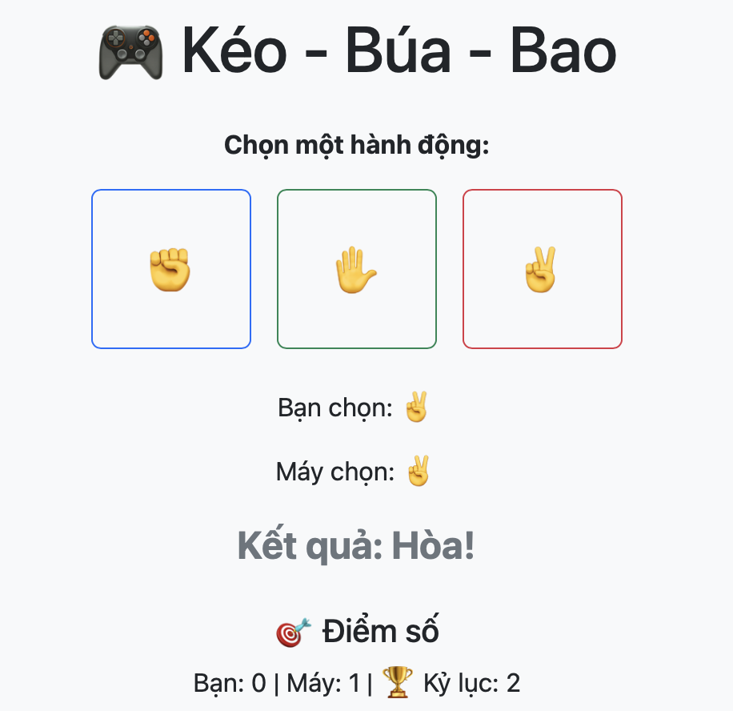

# 🎯 Thử thách Level 1 – Bổ sung giao diện Game Kéo Búa Bao

## Mục tiêu:
Bạn sẽ viết lại phần HTML để hiển thị:
- Lựa chọn của người chơi
- Lựa chọn của máy
- Kết quả thắng, thua, hòa

## Việc cần làm:
1. Mở file `index.html`
2. Tìm các dòng có ghi chú `<!-- TODO: ... -->`
3. Thêm lại:
```html
<p>Bạn chọn: <span id="userChoice">-</span></p>
<p>Máy chọn: <span id="computerChoice">-</span></p>
<p class="result" id="result">Kết quả: -</p>
```

## Kết quả mong muốn:
Giao diện hiển thị đầy đủ thông tin như ban đầu.

🛠 Bạn không cần sửa gì trong `script.js`, chỉ làm việc với HTML!
 Hình ảnh:
 
