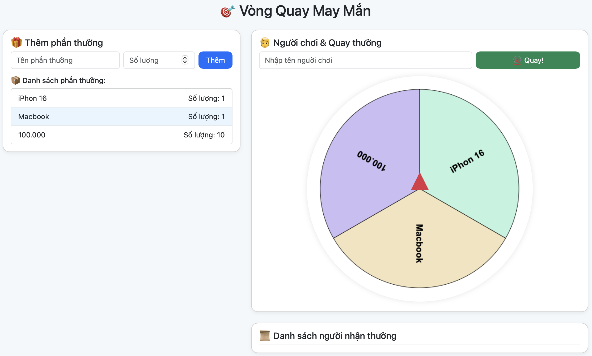

# 🧠 Thử thách Level 2 – Viết lại logic thêm phần thưởng

## 🎯 Mục tiêu:
Bạn cần viết lại hàm `addReward()` trong file `game2.js` để:
- Lấy thông tin phần thưởng từ input
- Thêm phần thưởng vào danh sách (cả trong JS và giao diện)
- Mỗi phần thưởng có tên và số lượng

## 🔍 Gợi ý:
1. Lấy giá trị từ các input có id là `rewardNameInput` và `rewardQuantityInput`
2. Kiểm tra dữ liệu đầu vào
3. Thêm phần tử vào mảng `rewardList` (nếu có)
4. Cập nhật giao diện (ul có id `rewardList`)

```js
let name = document.getElementById("rewardNameInput").value;
// ...
```

## ✅ Kết quả mong muốn:
Người chơi có thể thêm phần thưởng mới và chúng hiển thị đúng trong danh sách.
Ảnh: 