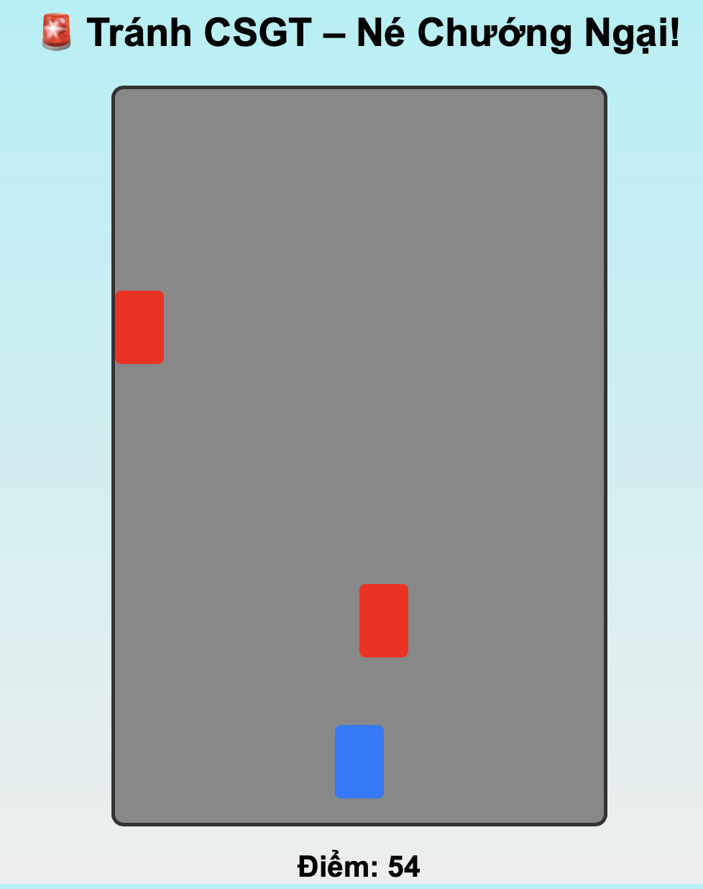

# 🎮 Thử thách Lập trình Game – Level 1 (game4): Hoàn thiện Giao Diện Game

## 🧠 Mục tiêu:
Hoàn thiện phần giao diện chính của trò chơi "Tránh CSGT".

## 📂 Tệp bạn có:
- `game4.html`: Đã bị xoá 2 phần tử HTML quan trọng (được thay bằng `<!-- TODO -->`)
- `game4.css`: Định dạng giao diện
- `game4.js`: Logic game đầy đủ

## 🔧 Việc cần làm:
1. Mở `game4.html`, tìm dòng có chứa:
   ```html
   <!-- TODO: Thêm lại <div id="player"></div> và <div id="obstacles"></div> ở đây -->
   ```
2. Thêm lại chính xác 2 thẻ HTML đã bị xoá:
   ```html
   <div id="player"></div>
   ```

3. Tuỳ chỉnh màu nền hoặc hình dạng nhân vật trong `game4.css`.

## 💡 Gợi ý:
- `#player` là nhân vật bạn điều khiển (dùng phím ← →).
- `#obstacles` chứa các chướng ngại vật sẽ xuất hiện ngẫu nhiên.

## ✅ Kết quả mong muốn:
- Trò chơi hiển thị nhân vật và chướng ngại vật đầy đủ.
- Người chơi có thể di chuyển và né tránh đúng cách.
- Hình ảnh 

