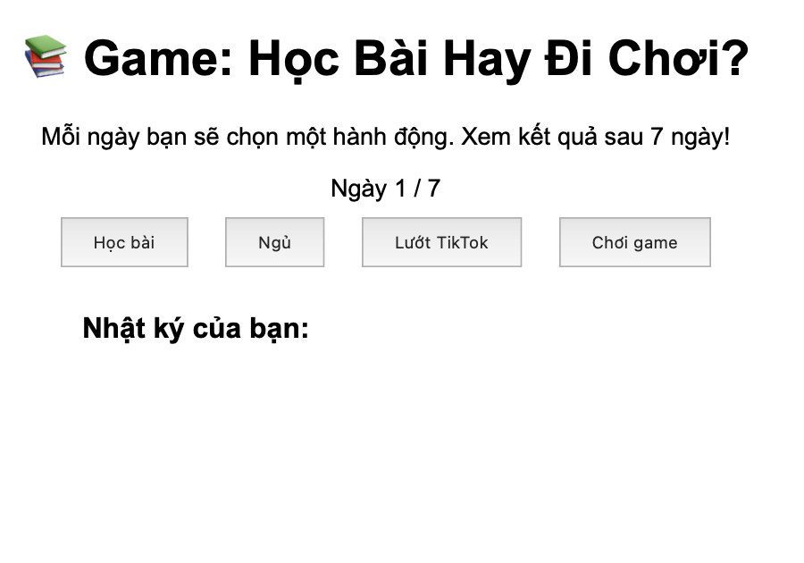

# 🎮 Thử thách Lập trình Game – Level 1 (game5): Thêm lại nút hành động

## 🧠 Mục tiêu:
Giúp người chơi có đủ lựa chọn hành động mỗi ngày trong game.

## 📂 Tệp bạn có:
- `game5.html`: Giao diện đã bị xoá 2 nút "Ngủ" và "Chơi game"
- `game5.js`: Logic game đầy đủ, không bị chỉnh sửa

## 🔧 Việc cần làm:
1. Mở file `game5.html`
2. Tìm dòng chứa:
   ```html
   <!-- TODO: Thêm lại 2 nút "Ngủ" và "Chơi game" tại đây -->
   ```
3. Chỉnh sửa màu sắc của button, text.


## 💡 Gợi ý:
- Đặt các nút trong `<div id="actions">`
- Các nút sẽ gọi hàm `choose(...)` đã có trong `game5.js`

## ✅ Kết quả mong muốn:
- Người chơi có thể chọn đủ 4 hành động mỗi ngày.
- Màu sắc hiệu ứng sinh động hơn
- Trò chơi chạy đúng và hiển thị nhật ký.
- Hình ảnh: 
