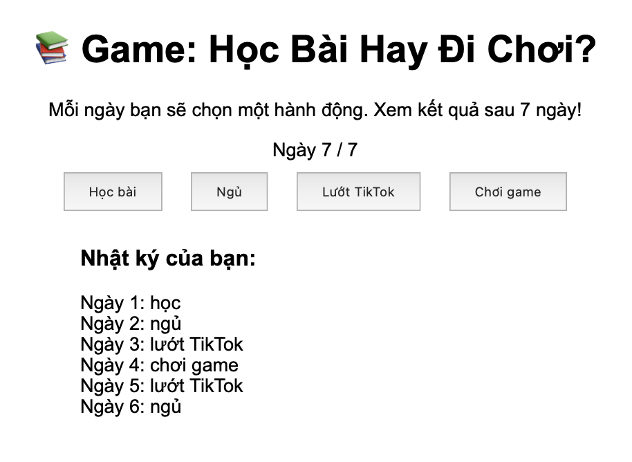

# 🎮 Thử thách Lập trình Game – Level 2 (game5): Viết lại hàm xử lý lựa chọn

## 🧠 Mục tiêu:
Tự viết lại logic khi người chơi chọn hành động mỗi ngày.

## 📂 Tệp bạn có:
- `game5.html`: Giao diện game
- `game5.js`: Hàm `choose(action)` đã bị xoá và thay bằng dòng `// TODO`

## 🔧 Việc cần làm:
1. Mở `game5.js`
2. Tìm đoạn:
```js
function choose(action) {
  // TODO: Viết lại hàm xử lý lựa chọn hành động mỗi ngày
}
```
3. Viết lại logic như sau:
- Nếu đã quá 7 ngày → dừng xử lý
- Thêm hành động vào mảng `actions`
- Tăng `currentDay`
- Nếu đã hết 7 ngày:
  - Gọi `showResult()`
  - Ẩn nút chọn
- Nếu chưa hết ngày:
  - Cập nhật hiển thị `dayStatus`
  - Gọi `updateLog()`

## ✅ Kết quả mong muốn:
- Mỗi khi chọn hành động, ngày được tăng lên và nhật ký cập nhật.
- Sau ngày thứ 7, hiển thị kết quả tổng kết.
- Hình ảnh: 