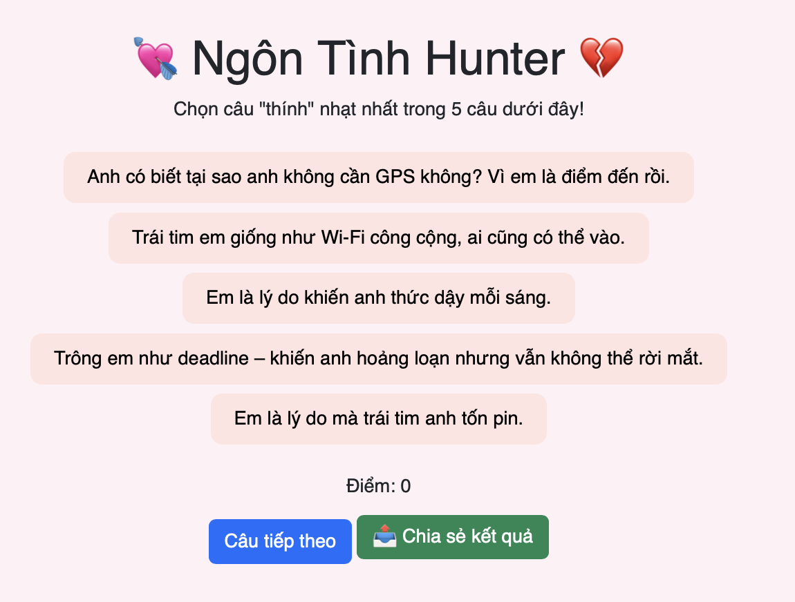

# 🎮 Thử thách Lập trình Game – Level 1 (game6): Hoàn thiện lựa chọn câu trả lời

## 🧠 Mục tiêu:
Hoàn thiện danh sách các câu "thính" để người chơi chọn trong mỗi câu hỏi.

## 📂 Tệp bạn có:
- `game6.js`: Đã bị xoá 2 lựa chọn trong mỗi câu hỏi (được ghi chú bằng `// TODO`)
- `game6.html`, `game6.css`: Giao diện và định dạng đầy đủ

## 🔧 Việc cần làm:
1. Mở file `game6.js`
2. Trong mỗi câu hỏi, tìm đoạn:
```js
options: [
  "...",
  "...",
  "..."
  // TODO: Thêm 2 lựa chọn còn thiếu tại đây
],
```
3. Thêm lại 2 dòng `"...",` để hoàn thành đủ 5 lựa chọn.

## 💡 Gợi ý:
- Có thể tự sáng tạo 2 câu "thính" hoặc xem lại phiên bản đầy đủ nếu có.
- Vị trí đúng là thêm dòng trước `],` và đảm bảo có dấu phẩy `,` ở cuối mỗi dòng.

## ✅ Kết quả mong muốn:
- Mỗi câu hỏi có đúng 5 lựa chọn.
- Giao diện hiển thị đủ các nút chọn, không lỗi.
- Hình ảnh: 