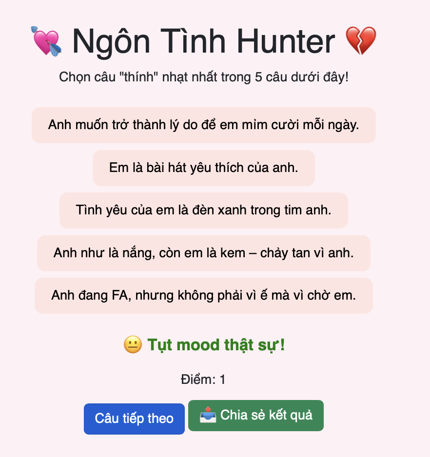

# 🎮 Thử thách Lập trình Game – Level 2 (game6): Viết lại logic kiểm tra đáp án

## 🧠 Mục tiêu:
Viết lại hàm kiểm tra người chơi có chọn đúng "câu thính nhạt nhất" không.

## 📂 Tệp bạn có:
- `game6.js`: Hàm `checkAnswer(choice)` đã bị xoá nội dung (chỉ còn dòng `// TODO`)
- `game6.html`, `game6.css`: Giao diện và định dạng vẫn đầy đủ

## 🔧 Việc cần làm:
1. Mở file `game6.js`
2. Tìm hàm:
```js
function checkAnswer(choice) {
  // TODO: Viết lại nội dung kiểm tra đáp án tại đây
}
```
3. Viết lại nội dung như sau:
- So sánh `choice === questions[current].weakest`
  - Nếu đúng:
    - Tăng biến `score`
    - Hiển thị phản hồi tích cực màu xanh
  - Nếu sai:
    - Hiển thị phản hồi sai màu đỏ
- Cập nhật nội dung `#score`

## ✅ Kết quả mong muốn:
- Khi chọn đúng "thính nhạt", điểm tăng và hiện phản hồi đúng.
- Khi chọn sai, hiện phản hồi sai.
- Hình ảnh 
