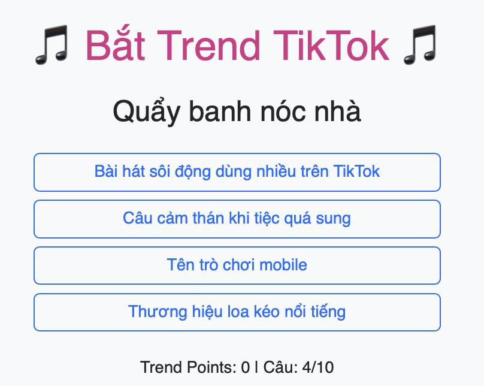

# 🎮 Thử thách Lập trình Game – Level 1 (game7): Hoàn thiện lựa chọn đúng

## 🧠 Mục tiêu:
Hoàn thành đầy đủ các lựa chọn cho mỗi câu trend trong game.

## 📂 Tệp bạn có:
- `game7.js`: Mỗi câu hỏi hiện chỉ còn 2 lựa chọn trong `options`, và có dòng `// TODO` yêu cầu bổ sung.
- `game7.html`, `game7.css`: Giao diện đầy đủ.

## 🔧 Việc cần làm:
1. Mở file `game7.js`
2. Tìm các đoạn như sau:
```js
options: [
  "...",
  "...",
  // TODO: Thêm 2 lựa chọn còn thiếu tại đây
],
```
3. Thêm vào 2 dòng để đủ 4 lựa chọn.
4. Đảm bảo có dấu phẩy `,` ở cuối mỗi dòng và đúng thứ tự.

## ✅ Kết quả mong muốn:
- Mỗi câu có đủ 4 lựa chọn.
- Trò chơi hiển thị đầy đủ giao diện và xử lý bình thường.
- Hình ảnh: 