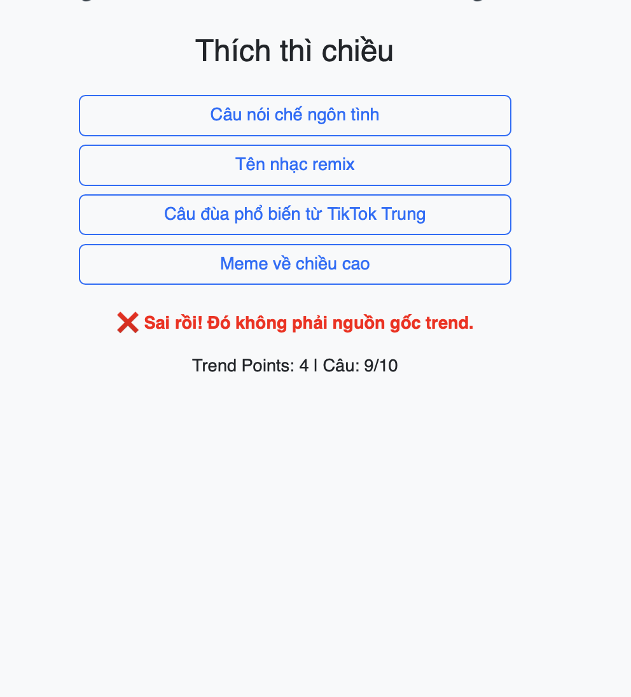

# 🎮 Thử thách Lập trình Game – Level 2 (game7): Viết lại hàm kiểm tra lựa chọn đúng

## 🧠 Mục tiêu:
Viết lại hàm `checkAnswer(index)` để kiểm tra người chơi có chọn đúng hashtag tương ứng với trend TikTok không.

## 📂 Tệp bạn có:
- `game7.js`: Hàm `checkAnswer(index)` đã bị xoá nội dung, chỉ còn `// TODO`
- `game7.html`, `game7.css`: Giao diện và phong cách đã hoàn chỉnh.

## 🔧 Việc cần làm:
1. Mở file `game7.js`
2. Tìm đoạn:
```js
function checkAnswer(index) {
  // TODO: Viết lại nội dung kiểm tra đáp án tại đây
}
```
3. Viết lại logic kiểm tra:
- So sánh `index === trends[currentQuestion].correct`
- Nếu đúng:
  - Cộng điểm
  - Hiển thị thông báo đúng và màu xanh
- Nếu sai:
  - Hiển thị phản hồi sai và màu đỏ
- Gọi `nextQuestion()` sau một khoảng delay

## ✅ Kết quả mong muốn:
- Trò chơi hoạt động như cũ
- Khi người chơi chọn đúng hashtag → tăng điểm
- Khi sai → không tăng điểm, hiển thị phản hồi
- Hình ảnh 
