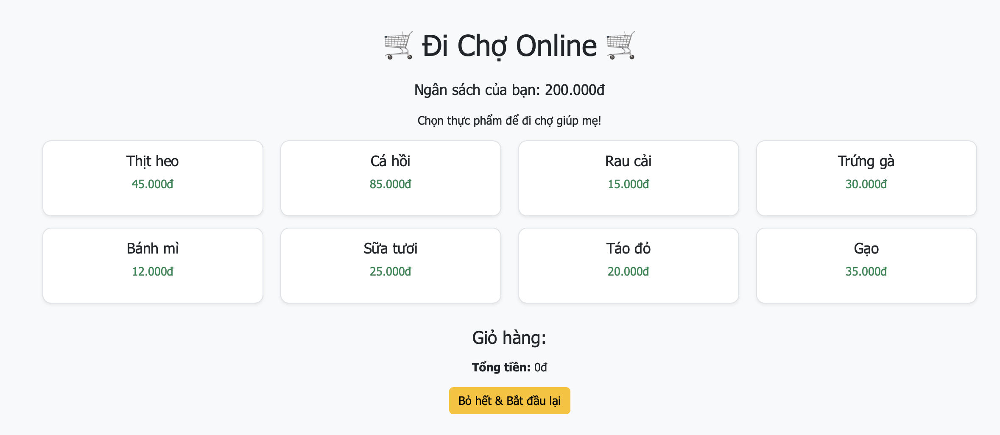

# 🛒 Thử thách Lập trình Game – Level 1 (game8): Bổ sung danh sách mặt hàng

## 🧠 Mục tiêu:
Hoàn thiện mảng `items[]` – danh sách các món thực phẩm trong trò chơi.

## 📂 Tệp bạn có:
- `game8.js`: Mảng `items` chỉ còn 4 món đầu tiên. 4 món còn lại đã bị xoá và có đánh dấu `// TODO`.
- `game8.html`, `game8.css`: Giao diện và phong cách đã hoàn chỉnh.

## 🔧 Việc cần làm:
1. Mở file `game8.js`
2. Tìm đoạn code:
```js
const items = [
  { name: "Thịt heo", price: 45000 },
  { name: "Cá hồi", price: 85000 },
  { name: "Rau cải", price: 15000 },
  { name: "Trứng gà", price: 30000 },
  // TODO: Thêm 4 mặt hàng bị thiếu vào đây
];
```
3. Viết tiếp 4 dòng để hoàn thành danh sách thực phẩm (ví dụ như `"Bánh mì"`, `"Sữa tươi"`, ...).
4. Khi đưa chuột tới mỗi mặt hàng thì đổi màu (hover)

⚠️ Đảm bảo:
- Đúng cú pháp `{ name: "...", price: ... }`
- Cách nhau bằng dấu phẩy `,`

## ✅ Kết quả mong muốn:
- Giao diện hiển thị đầy đủ 8 mặt hàng
- Người chơi có thể chọn các món để đi chợ mà không bị lỗi
- Thay đổi màu nền của mặt hàng khi hover
- Hình ảnh 