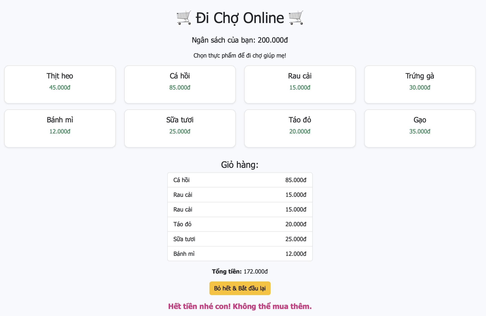

# 🛒 Thử thách Lập trình Game – Level 2 (game8): Viết lại xử lý giỏ hàng

## 🧠 Mục tiêu:
Viết lại hàm `addItem(index)` để xử lý thêm hàng vào giỏ, cộng tổng tiền và hiển thị cảnh báo khi vượt ngân sách.

## 📂 Tệp bạn có:
- `game8.js`: Hàm `addItem(index)` đã bị xoá nội dung, chỉ còn `// TODO`.
- `game8.html`, `game8.css`: Giao diện đã đầy đủ.

## 🔧 Việc cần làm:
1. Mở file `game8.js`
2. Tìm đoạn:
```js
function addItem(index) {
  // TODO: Viết lại logic thêm mặt hàng vào giỏ và cập nhật tổng tiền
}
```
3. Viết lại đoạn mã:
- Lấy món hàng từ `items[index]`
- Cộng tiền vào biến `total`
- Nếu `total > budget`, hiển thị thông báo
- Nếu chưa vượt, hiển thị món hàng trong `#cart-list` và cập nhật `#total`

### 💡 Gợi ý:
```js
const item = items[index];
total += item.price;
if (total > budget) {
  messageBox.textContent = "Hết tiền nhé con!";
  total -= item.price; // không cho thêm vào
} else {
  cartList.innerHTML += `<li>${item.name} - ${item.price}đ</li>`;
  totalBox.textContent = total;
}
```

## ✅ Kết quả mong muốn:
- Chọn được món vào giỏ
- Không vượt quá ngân sách
- Hiển thị đúng danh sách món đã chọn và tổng tiền
- Hình ảnh 