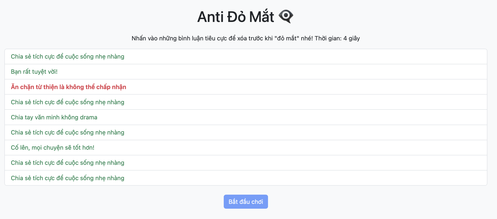

# 👁️‍🗨️ Thử thách Lập trình Game – Level 1 (game9): Bổ sung bình luận

## 🧠 Mục tiêu:
Hoàn thiện danh sách `commentsPool[]` bằng cách thêm 4 bình luận vào danh sách đã bị xoá.

## 📂 Tệp bạn có:
- `game9.js`: Mảng `commentsPool` đã bị xoá 4 bình luận cuối.
- `game9.html`, `game9.css`: Giao diện và phong cách đã hoàn chỉnh.

## 🔧 Việc cần làm:
1. Mở file `game9.js`
2. Tìm đoạn:
```js
const commentsPool = [
  { text: "Trà xanh làm gì cũng bị soi", negative: true },
  { text: "Chia tay văn minh không drama", negative: false },
  { text: "Ăn chặn từ thiện là không thể chấp nhận", negative: true },
  { text: "Bạn rất tuyệt vời!", negative: false },
  { text: "Những bình luận này gây đỏ mắt quá", negative: true },
  { text: "Cố lên, mọi chuyện sẽ tốt hơn!", negative: false },
  // TODO: Thêm 4 bình luận tích cực/tiêu cực vào đây để đa dạng nội dung
];
```
3. Thêm tiếp 4 bình luận, ít nhất 1 bình luận tích cực và 1 bình luận tiêu cực.

⚠️ Đảm bảo:
- Đúng cú pháp `{ text: "...", negative: true/false }`
- Dùng dấu `,` phân cách giữa các dòng

## ✅ Kết quả mong muốn:
- Game có đủ bình luận để tạo ngẫu nhiên
- Bình luận hiển thị đa dạng, tăng tính thực tế và thử thách
- Hình ảnh: 
