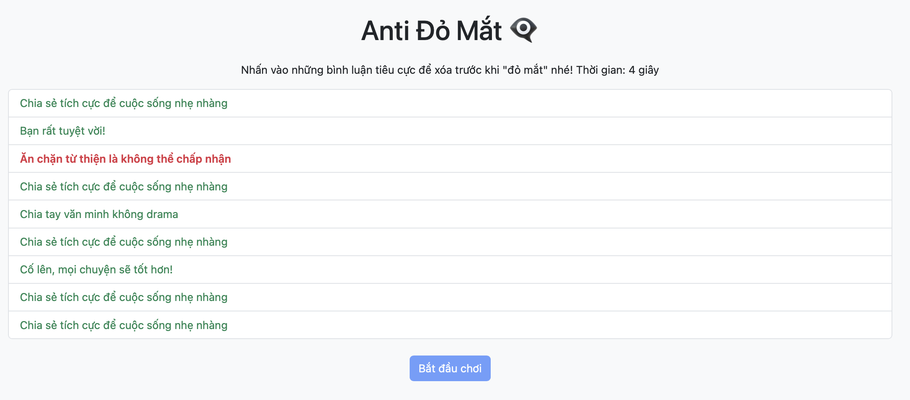

# 👁️‍🗨️ Thử thách Lập trình Game – Level 2 (game9): Viết lại xử lý bình luận

## 🧠 Mục tiêu:
Viết lại phần xử lý khi người chơi nhấn vào bình luận – phân biệt bình luận tiêu cực và tích cực.

## 📂 Tệp bạn có:
- `game9.js`: Đã xoá đoạn xử lý `div.addEventListener(...)` trong `addComment()`.
- `game9.html`, `game9.css`: Giao diện đã đầy đủ.

## 🔧 Việc cần làm:
1. Mở file `game9.js`
2. Tìm đoạn có `// TODO: Viết lại logic xử lý khi người chơi click vào bình luận`
3. Viết lại đoạn mã xử lý như sau:

### 💡 Gợi ý:
```js
div.addEventListener("click", () => {
  if (comment.negative) {
    div.remove();
    negativeLeft--;
    if (negativeLeft <= 0) {
     
    }
  } else {
    alert("Bình luận này không tiêu cực đâu!");
  }
});
```

## ✅ Kết quả mong muốn:
- Người chơi nhấn vào bình luận tiêu cực → bình luận bị xóa, giảm `negativeLeft`
- Nếu đủ số lượng tiêu cực bị xoá → thắng
- Nếu nhấn nhầm bình luận tích cực → cảnh báo
- Hình ành : 
